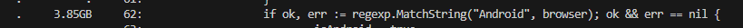
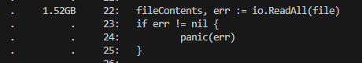
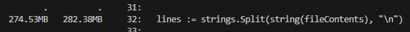
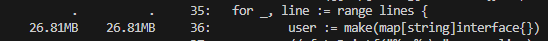
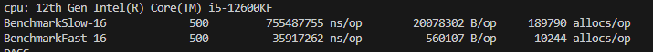
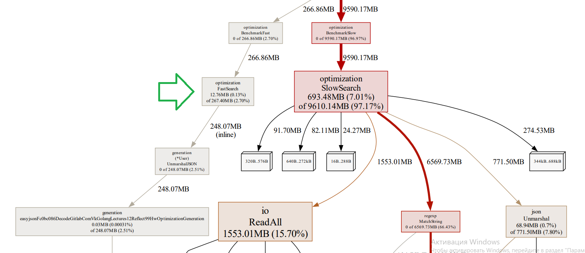
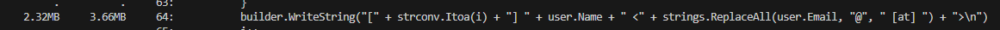

# Оптимизация

Первое, что я сделал, это просто ввел команду ```go test -bench . -benchmem -cpuprofile cpu.out -memprofile mem.out -memprofilerate 1  ```  и зашел в ```go tool pprof```, чтобы посмотреть с помощью команды ```list``` основные проблемы.

Что по памяти, что по процессору самыми ресурсоемкими оказались одни и те же моменты:
1. regexp'ы без компиляции

    1.1 

    1.2 
2. unmarshal JSON'а

    2.1 
3. Считывание всех строк в один массив, а потом его сплит в другой массив

    3.1 

    3.2 

4. Дальше в глаза бросилась конкатенация строк

    4.1 
5. Нашлось и использование массива без предвыделения

    5.1 

    5.2 
6. Создание нового ```user``` на каждой итерации

    6.1 

7. Достаточно увесистый Fprintln

    7.1 


## Оптимизация 1: Удаление RegExp
Первое что я сделал, это удалил regexp'ы. Я посчитал, что сами регулярки здесь простые и представляют собой поиск подстроки в строке. Так зачем тогда они вообще нужны? Поиск подстроки в строке через ```string.Contains``` будет всяко быстрее, его и сделал. 
```go
if ok := strings.Contains(browser, "Android"); ok
...
if ok := strings.Contains(browser, "MSIE"); ok {
```

## Оптимизация 2: Unmarshal JSON
Для ускорения распаковки JSON, а также для уменьшения используемой памяти во время этой операции я решил воспользоваться либой easyJSON и сгенерировать уникальные Marshal и Unmarshal для данного в условии файла. 
Для этого мне потребывалось создать структуру, названия полей и их тип брал исходя из того, что лежит в файле. 
```go
type User struct {
	Browsers []string `json:"browsers"`
	Company  string   `json:"company"`
	Country  string   `json:"country"`
	Email    string   `json:"email"`
	Job      string   `json:"job"`
	Name     string   `json:"name"`
	Phone    string   `json:"phone"`
}
```
В самом коде все теперь выглядит так:
```go
err = user.UnmarshalJSON(scanner.Bytes())
		if err != nil {
			panic(err)
		}
```
Внедрение сгенерированного ```UnmarshalJSON``` значительно сократило число аллокаций и байт на операцию.
Кроме того, во многих строчках кода теперь берутся поля структуры типа ```User```, без необходимости делать приведение типа и дополнительные аллокации (например ```browser := rawBrowser.(string)```).

## Оптимизация 3: Конкатенация 
В коде SlowSearch есть наивная конкатенация строк ``` foundUsers += fmt.Sprintf("[%d] %s <%s>\n", i, user["name"], email)``` с использованием оператора ```+=```, она приводит к частым перевыделениям памяти и копированию в них исходных данных. Эту проблему я решил использовав ```strings.Builder``` с заранее выделенным числом байт(5000, взято на рандом), это привело к уменьшению B/op и allocs/op. Кроме того, я отказался от Sprintf(чтобы избежать создания промежуточной структуры) в пользу формирования строки внутри билдера, это дало совсем небольшой, но тем не менее прирост. 

Код стал выглядить так:
```go
builder.WriteString("[" + strconv.Itoa(i) + "] " + user.Name + " <" + strings.ReplaceAll(user.Email, "@", " [at] ") + ">\n")
```
Как видно от regexp'а для email я тоже отказался, и это тоже дало небольшой прирост в производительности. 

## Оптимизация 4:  Один цикл > Два цикла

При рассмотрении кода SlowSearch в глаза сразу бросилось два цикла по одним и тем же данным - массиву ```browsers```, поэтому сразу возникла идея склеить это в один цикл. Да, на число попугаев в бенчмарке, как и на число аллокаций/байт это повлияет крайне незначительно, но общее время работы сократится. Также, я подумал, что каждый раз ходить по массиву  ```seenBrowsers```, искать там элемент и потом еще и делать ```append```, что может приводить к дополнительным копированиям и аллокациям, - занятие неблагодарное. Исходя из этого, вместо массива я сделал ```map[string]bool``` и предвыделил для него память на 500 элементов. Думал, что этого хватит с большим запасом, но, увидев в ответе 114 браузеров, понял, что браузеров знаю мало, и так и оставил 500 предвыделенных элементов. 

С учетом всех этих действий код стал выглядит так:
```go
seenBrowsers := make(map[string]bool, 500)

...

for _, browser := range user.Browsers {
			if ok := strings.Contains(browser, "Android"); ok {
				isAndroid = true
				if _, ok := seenBrowsers[browser]; !ok {
					seenBrowsers[browser] = true
					uniqueBrowsers++
				}
			}
			if ok := strings.Contains(browser, "MSIE"); ok {
				isMSIE = true
				if _, ok := seenBrowsers[browser]; !ok {
					seenBrowsers[browser] = true
					uniqueBrowsers++
				}
			}
		}
```

## Оптимизация 5: Долой агрегацию

Следующие изменения стали возможны при немного более детальном изучении кода -  в нем обнаружилось немало агрегаций данных без видимой на то причины. Очевидно, подобные агрегации добавляли аллокаций и увеличивали объем используемой памяти. 
Я выделил следующие места с ненужной агрегацией:
    1. Считывание всего файла в массив байт. (Зачем, если можно читать по строке?)
    2. Сплит этих данных в массив. (Зачем, если можно обрабатывать по строке?)
    3. Unmarshal строки в ```user``` в цикле, причем каждый раз еще и строка обратно приводится к байтам. (Зачем, если можно пихать сразу байты и обрабатывать по строке?)
    4. Добавления нового ```user``` в массив  ```users```. (Зачем, если дальше мы просто итерируемся по этому массиву, можно просто обрабатывать по одному пользователю?)

Поэтому, я все сделал внутри одного цикла: читаем строку -> Unmarshal -> смотрим браузеры -> добавляем в ```strings.Builder```.
Использовал ```bufio.scanner```. Очень много B/op срезалось за счет того, что не делал промежуточное присваивание значения сканера в строку, которая потом снова переводится в байты и отправляется в Unmarshal.

Код начал выглядеть примерно так:
```go
scanner := bufio.NewScanner(file)
	for scanner.Scan() {
		err = user.UnmarshalJSON(scanner.Bytes())
		if err != nil {
			panic(err)
		}
        ...
	}
```

## Оптимизация 6: Fprintln

Эту штуку было уже не очень просто заметить внешне, но обратившись к профилировщику, достаточно быстро ее нашел. В профилировщике заметил, что у строки ```fmt.Fprintln(out, "found users:\n"+foundUsers)``` большой расход памяти, и внимательно присмотревшись понял, что дело в аргументе при вызове этой функции. Там мы создаем новую строку через оператор ```+```, причем справа от него стоит ```builder``` в котором может быть много, очень много строк. Такое конструирование новой строки подразумевает выделение большого объема памяти и копирования в эту область памяти данных. Чтобы избавиться от конструирования такой массивной и в тоже время бесполезной строки, я просто записал ```found users``` в ```builder``` после его создания, сэкономив на этом столь ценные байты на операцию. 

Теперь код выглядит так 
```go 
    builder.WriteString("found users:\n")
    ...
    builder.WriteString("\nTotal unique browsers ")
	builder.WriteString(strconv.Itoa(uniqueBrowsers))
	fmt.Fprintln(out, builder.String())
```

### Итог 

В результате всех этих оптимизаций мне удалось получить следующие показатели бенчмарка:
    

Если подробнее посмотреть профилировщик, то видим:
1. Огромные траты на regexp'ы и ReadALL просто исчезли (в графе нет стрелок к ним).
    
2. Расходы на Unmarshal сократились чуть ли не в 5 раз!
    
3. Больше нет расходов на ```lines```, выделения ```user``` на каждой итерации чтения строки.
    
4. Серьезно уменьшились расходы на наивной конкатенации.
    
5. Сократилось потребление памяти со стороны  ```fmt.Fprintln```
    